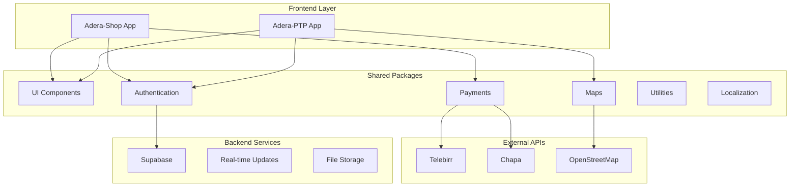

---
{"dg-publish":true,"dg-path":"Project-Adera-EcoSystem (AHA)/High-Level System Architecture.md","permalink":"/Project-Adera-EcoSystem (AHA)/High-Level System Architecture/","dgPassFrontmatter":true,"noteIcon":""}
---




=========== ===================== =========

// Generally :-

## System Architecture

### High-Level Architecture


========

### Monorepo Structure Pattern
```
/
├── apps/                    # Application entry points
│   ├── adera-ptp/          # Logistics app (Expo)
│   └── adera-shop/         # E-commerce app (Expo)
├── packages/               # Shared libraries
│   ├── ui/                 # Design system components
│   ├── auth/               # Authentication logic
│   ├── payments/           # Payment gateway integrations
│   ├── maps/               # Location services
│   ├── utils/              # Common utilities
│   └── localization/       # i18n support
└── .adera/                 # Project metadata
    ├── memory/             # Memory bank
    └── changelogs/         # Release notes
```


============


For more details, see the contents of the [[Project-Adera-EcoSystem (AHA)/General-Overall-System-Patterns-&-Architecture\|General-Overall-System-Patterns-&-Architecture]] 


